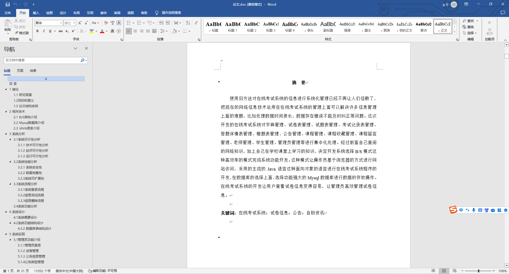
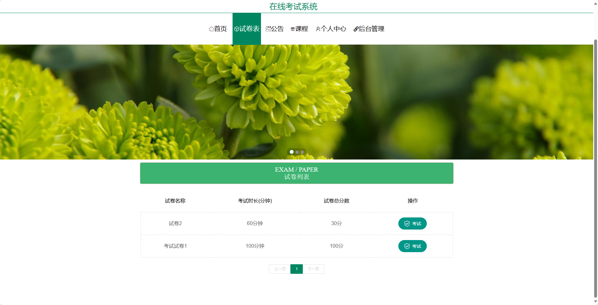
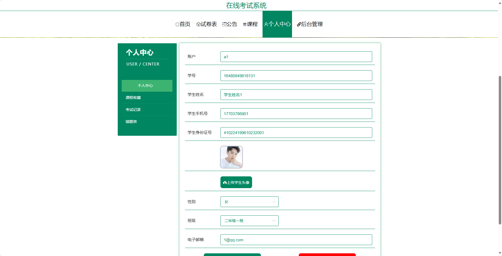
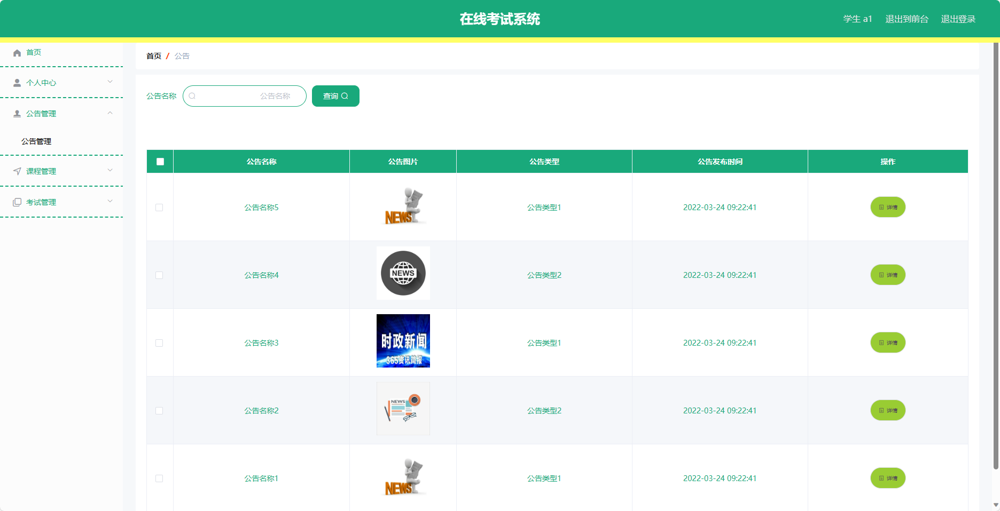
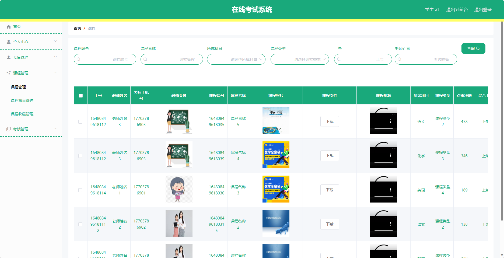
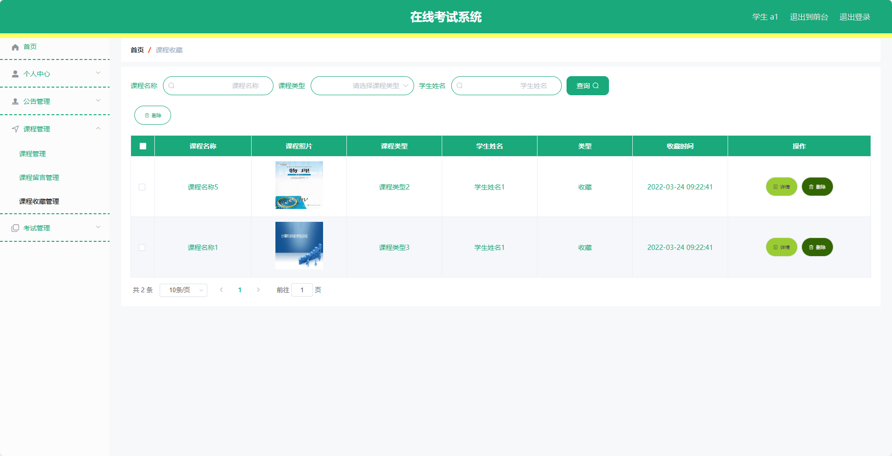
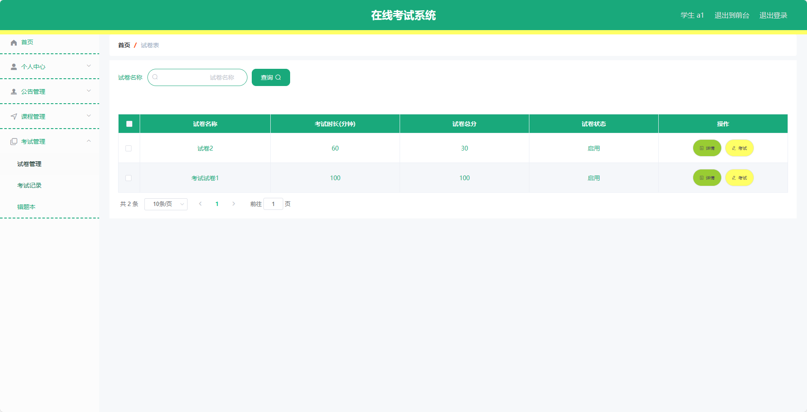
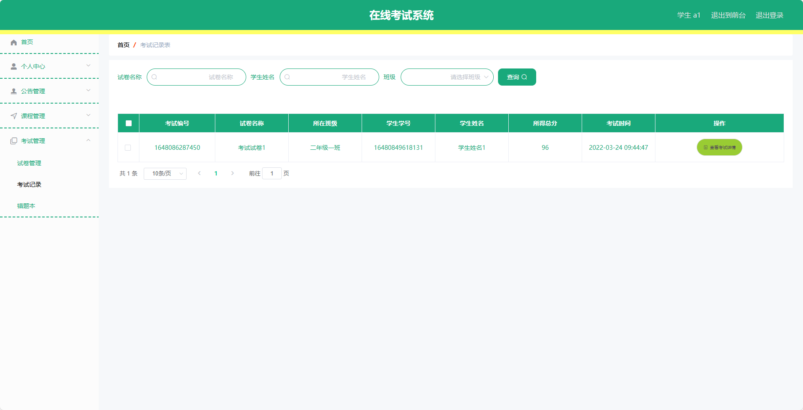

## 基于SpringBoot的在线考试系统(程序+报告)

###  获取sql数据库文件: 从戎源码网 (https://armycodes.com/) QQ: 386869957 QQ群: 377586148
###  所有系统地址: (https://github.com/YuLin-Coder/AllProjectCatalog) 
###  所有项目以及源代码本人均调试运行无问题 可支持远程安装部署调试、定制修改、代码讲解

## 项目介绍
基于SpringBoot的在线考试系统，系统包含两种角色：管理员、用户,系统分为前台和后台两大模块，主要功能如下。

### 【管理员】:
- 个人中心：管理个人信息，包括修改个人信息、查看考试记录等。
- 基础数据管理：管理系统的基础数据，包括课程、老师、学生等信息。
- 公告管理：管理系统的公告信息，包括添加、编辑、删除公告等操作。
- 课程管理：管理系统的课程信息，包括添加、编辑、删除课程等操作。
- 老师管理：管理系统的老师信息，包括添加、编辑、删除老师等操作。
- 学生管理：管理系统的学生信息，包括添加、编辑、删除学生等操作。
- 试卷管理：管理系统的试卷信息，包括添加、编辑、删除试卷等操作。
- 考试管理：管理系统的考试信息，包括查看考试安排、参加考试、查看考试成绩等操作。
- 轮播图信息：管理系统的轮播图信息，包括添加、编辑、删除轮播图等操作。

### 【用户】:
- 个人中心：管理个人信息，包括修改个人信息、查看考试记录等。
- 公告管理：管理系统的公告信息，包括添加、编辑、删除公告等操作。
- 课程管理：管理系统的课程信息，包括添加、编辑、删除课程等操作。
- 考试管理：管理系统的考试信息，包括查看考试安排、参加考试、查看考试成绩等操作。

### 老师：
- 个人中心：管理个人信息，包括修改个人信息、查看考试记录等。
- 公告管理：管理系统的公告信息，包括添加、编辑、删除公告等操作。
- 课程管理：管理系统的课程信息，包括添加、编辑、删除课程等操作。
- 试卷管理：管理系统的试卷信息，包括添加、编辑、删除试卷等操作。
- 考试管理：管理系统的考试信息，包括查看考试安排、参加考试、查看考试成绩等操作。
    
### 【前台】:
- 首页：展示系统的一些基本信息和轮播图。
- 试卷表：展示可供用户选择的试卷列表。
- 公告：展示系统的公告信息，包括考试通知、成绩公布等。
- 课程：展示用户所选课程的相关信息。
- 个人中心：管理个人信息，包括修改个人信息、查看考试记录等。

## 项目技术
- 编程语言：Java
- 数据库：MySQL
- 项目管理工具：Maven
- 前端技术：HTML、CSS、JavaScript、Jquery、Vue
- 后端技术：Spring、SpringMVC、MyBatis

## 运行环境
- JDK版本：JDK1.8及以上
- 开发工具：IDEA、Ecplise、Myecplise都可以
- 数据库: MySQL5.7及以上
- Maven：maven3.0及以上
- Node：14.14.0及以上

## 运行截图

